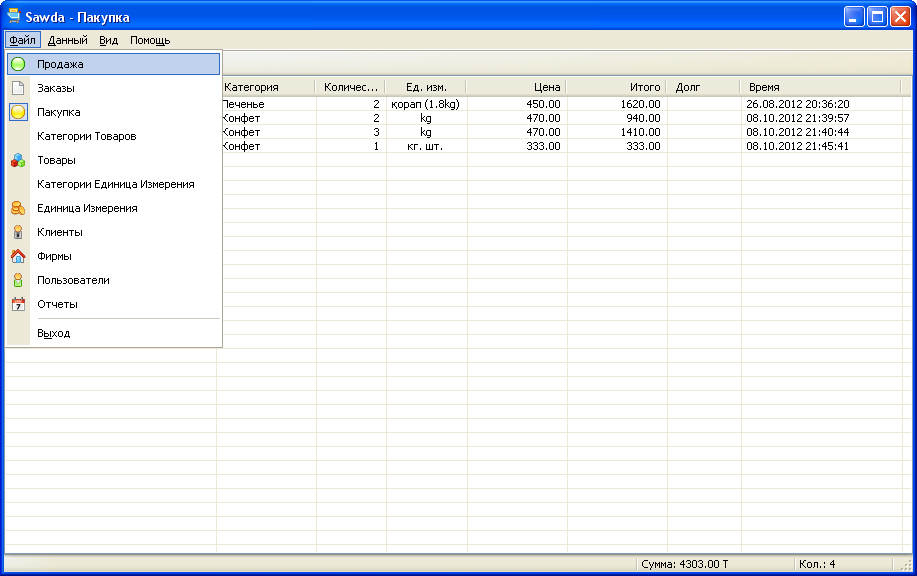
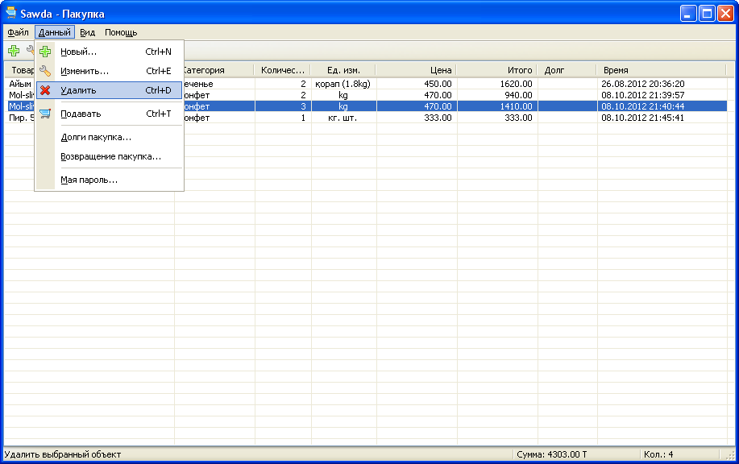
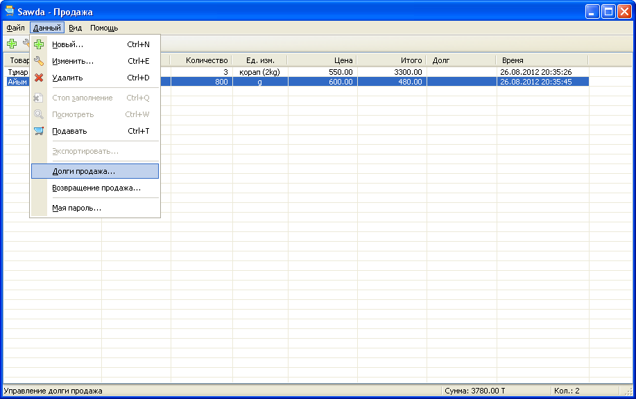
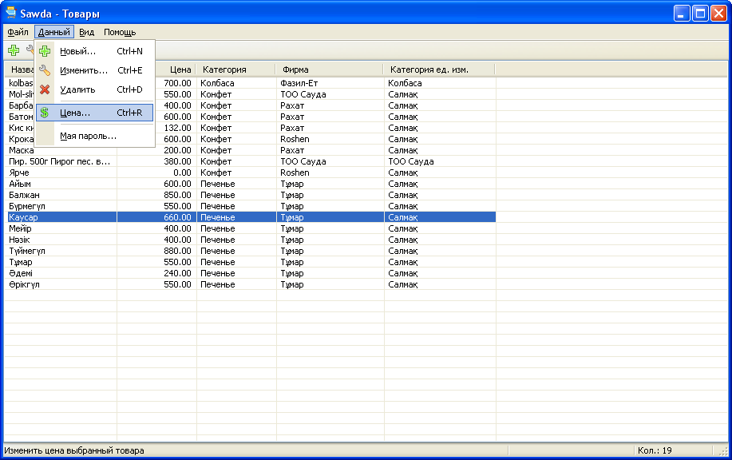
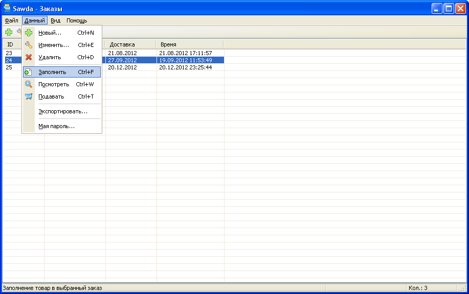
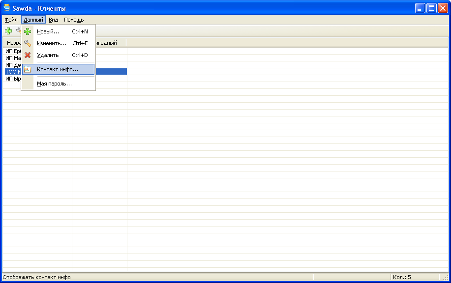
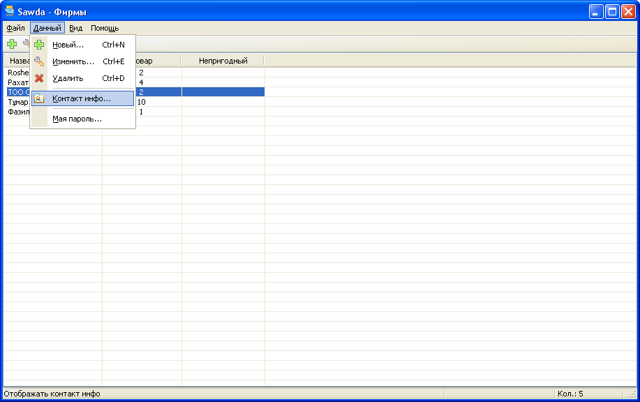
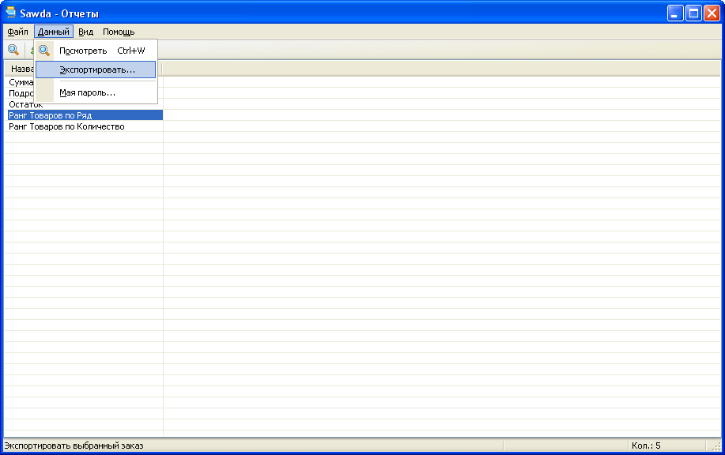
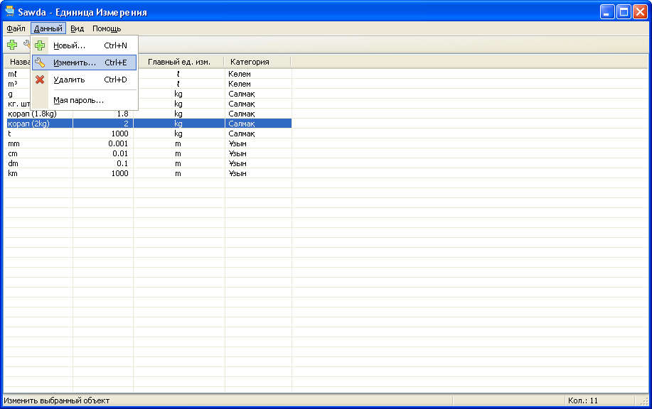
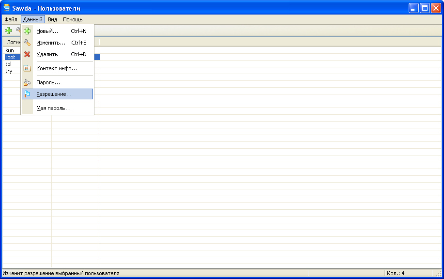

#  Trade

Application for stores (original name - Sawda). Registers all purchases, sales, products, orders, companies and clients. And generates various reports. Has user authentication function and roles for users.

Created in 2012 using C++, MFC and MySQL

**Screenshots**

Capability:

Purchases:

Sales:

Products:

Orders:

Clients:

Companies:

Reports:

Units:

Users:

